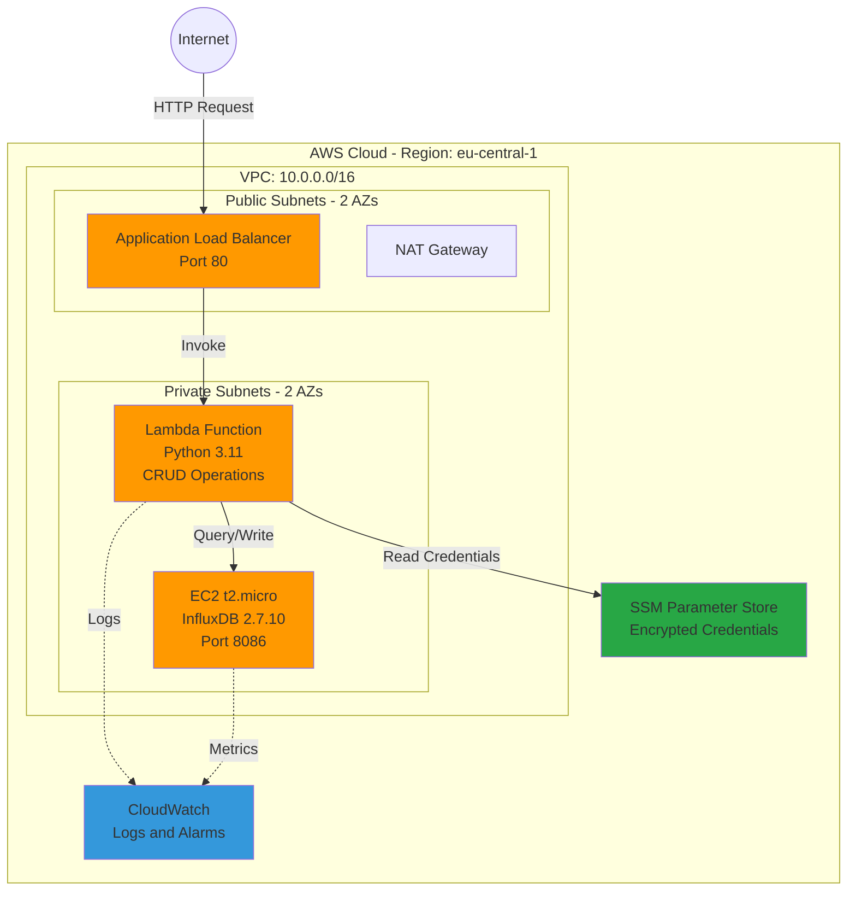

# InfluxDB CRUD API on AWS

A serverless time-series database infrastructure using AWS CDK with Lambda-based CRUD API, InfluxDB on EC2, and secure SSM Parameter Store for credentials.

---

## Architecture Diagram



**Architecture Highlights:**
- 🔒 Private InfluxDB with NO public IP
- 🔐 SSM Parameter Store with encryption
- ⚡ Serverless Lambda API
- 🌐 Multi-AZ high availability
- 📊 CloudWatch monitoring

---

## Deployment Instructions

### Prerequisites

- **AWS Account** with appropriate permissions
- **AWS CLI** configured with credentials
- **Node.js** 18.x or later
- **npm** 8.x or later

### Step 1: Install Dependencies

Clone the repository and install all required packages:

```bash
cd test
npm install
```

This installs AWS CDK libraries, TypeScript compiler, Jest for testing, and all project dependencies.

### Step 2: Bootstrap AWS CDK

Bootstrap CDK in your AWS account (only needed once per account/region):

```bash
npx cdk bootstrap aws://YOUR_ACCOUNT_ID/eu-central-1
```

Replace YOUR_ACCOUNT_ID with your actual AWS account ID. Example:
```bash
npx cdk bootstrap aws://360066926992/eu-central-1
```

**What this does:**
- Creates an S3 bucket for CDK assets
- Creates IAM roles for CloudFormation
- Sets up CDK toolkit stack

### Step 3: Configure SSM Parameters

Create the required SSM parameters with your InfluxDB credentials:

```bash
# Create auth token (SecureString - encrypted)
aws ssm put-parameter \\
  --name "/influxdb/auth-token" \\
  --value "my-super-secret-auth-token" \\
  --type SecureString \\
  --region eu-central-1

# Create organization name
aws ssm put-parameter \\
  --name "/influxdb/organization" \\
  --value "myorg" \\
  --type String \\
  --region eu-central-1

# Create bucket name
aws ssm put-parameter \\
  --name "/influxdb/bucket" \\
  --value "mybucket" \\
  --type String \\
  --region eu-central-1
```

**Important Notes:**
- Use a strong, unique token for /influxdb/auth-token
- The auth token is automatically encrypted by AWS KMS
- To update existing parameters, add --overwrite flag

**Verify parameters were created:**
```bash
aws ssm get-parameter --name "/influxdb/auth-token" --with-decryption --region eu-central-1
aws ssm get-parameter --name "/influxdb/organization" --region eu-central-1
aws ssm get-parameter --name "/influxdb/bucket" --region eu-central-1
```

### Step 4: Deploy the Stack

Preview the changes CDK will make:

```bash
npx cdk diff
```

Deploy the infrastructure:

```bash
npx cdk deploy
```

Or use the npm script:

```bash
npm run deploy
```

**Deployment Process:**
1. CDK synthesizes CloudFormation template
2. Shows resource changes (review carefully)
3. Asks for confirmation - type y and press Enter
4. Creates all AWS resources (12-15 minutes)
5. Outputs the ALB DNS name

**Expected Output:**
```
✅  InfluxDbCrudStack

Outputs:
InfluxDbCrudStack.LoadBalancerDNS = Influx-CrudA-XXXXXX.eu-central-1.elb.amazonaws.com
```

**Save the ALB DNS name** - you will need it to test the API!

### Step 5: Wait for InfluxDB Initialization

After deployment completes, wait 2-3 minutes for:
- EC2 instance to fully boot
- Docker to install and start
- InfluxDB container to initialize
- Health checks to pass

**Check deployment status:**
```bash
./scripts/check-deployment-status.sh
```

This script will:
- Query CloudFormation stack status
- Check if all resources are created
- Verify health endpoints
- Display ALB DNS name

---

## How to Test the Endpoints

### 1. Health Check

Verify the API is running:

```bash
curl http://YOUR-ALB-DNS/health
```

**Expected Response:**
```json
{"status": "healthy"}
```

### 2. Write Data

Write a temperature measurement to InfluxDB:

```bash
curl -X POST http://YOUR-ALB-DNS/write \
  -H "Content-Type: application/json" \
  -d '{
    "measurement": "temperature",
    "tags": {
      "location": "office",
      "sensor": "sensor1"
    },
    "fields": {
      "value": 22.5
    }
  }'
```

**Expected Response:**
```json
{"message": "Data written successfully"}
```

**Write multiple fields:**
```bash
curl -X POST http://YOUR-ALB-DNS/write \
  -H "Content-Type: application/json" \
  -d '{
    "measurement": "temperature",
    "tags": {
      "location": "office",
      "sensor": "sensor1"
    },
    "fields": {
      "value": 22.5,
      "humidity": 45,
      "pressure": 1013.25
    }
  }'
```

### 3. Query Data

Retrieve the data you just wrote:

```bash
curl -X POST http://YOUR-ALB-DNS/query \
  -H "Content-Type: application/json" \
  -d '{
    "measurement": "temperature",
    "range": "-1h"
  }'
```

**Expected Response:**
```json
{
  "data": [
    {
      "_time": "2025-10-04T12:34:56.789Z",
      "_measurement": "temperature",
      "_field": "value",
      "_value": 22.5,
      "location": "office",
      "sensor": "sensor1"
    }
  ]
}
```

**Query with filters:**
```bash
curl -X POST http://YOUR-ALB-DNS/query \
  -H "Content-Type: application/json" \
  -d '{
    "measurement": "temperature",
    "range": "-24h",
    "filters": {
      "location": "office"
    }
  }'
```

**Common time ranges:**
- `-1h` - Last hour
- `-24h` - Last 24 hours
- `-7d` - Last 7 days
- `-30d` - Last 30 days

### 4. Delete Data

Delete measurements from a specific time range:

```bash
curl -X POST http://YOUR-ALB-DNS/delete \
  -H "Content-Type: application/json" \
  -d '{
    "measurement": "temperature",
    "start": "2025-10-04T00:00:00Z",
    "stop": "2025-10-04T23:59:59Z",
    "predicate": "location=\"office\""
  }'
```

**Expected Response:**
```json
{"message": "Data deleted successfully"}
```

**Delete with multiple conditions:**
```bash
curl -X POST http://YOUR-ALB-DNS/delete \
  -H "Content-Type: application/json" \
  -d '{
    "measurement": "temperature",
    "start": "2025-10-04T00:00:00Z",
    "stop": "2025-10-04T23:59:59Z",
    "predicate": "location=\"office\" AND sensor=\"sensor1\""
  }'
```

### 5. Run Complete Test Suite

Use the automated test script that tests all endpoints:

```bash
./scripts/test-api.sh
```

**What this script does:**
1. Checks health endpoint
2. Writes sample data
3. Queries and validates the data
4. Deletes test data
5. Reports pass/fail for each test

**Sample Output:**
```
================================================================================
Testing InfluxDB CRUD API
================================================================================
ALB DNS: Influx-CrudA-XXXXXX.eu-central-1.elb.amazonaws.com

[1/4] Testing Health Endpoint...
✅ PASS: Health check successful

[2/4] Testing Write Operation...
✅ PASS: Write operation successful

[3/4] Testing Query Operation...
✅ PASS: Query returned data

[4/4] Testing Delete Operation...
✅ PASS: Delete operation successful

================================================================================
ALL TESTS PASSED ✅
================================================================================
```

---

## API Reference

### Available Endpoints

| Method | Path | Description |
|--------|------|-------------|
| GET | /health | Health check endpoint |
| POST | /write | Write data to InfluxDB |
| POST | /query | Query data from InfluxDB |
| POST | /delete | Delete data from InfluxDB |

### Request Body Schemas

**Write:** `measurement` (required), `tags` (object), `fields` (object with numbers/strings)  
**Query:** `measurement` (required), `range` (e.g., '-1h'), `filters` (object)  
**Delete:** `measurement` (required), `start` & `stop` (ISO 8601 timestamps), `predicate` (string)

---

## Development

### Run Unit Tests
```bash
npm test
```
Runs 69 unit tests across all constructs.

### Run Integration Tests
```bash
./scripts/test-api.sh
```
Tests the deployed API endpoints.

### Check Deployment Status
```bash
./scripts/check-deployment-status.sh
```
Verifies CloudFormation stack and resource health.

### Useful CDK Commands
- `npx cdk ls` - List all stacks
- `npx cdk diff` - Compare deployed vs current state
- `npx cdk synth` - Generate CloudFormation template
- `npx cdk deploy` - Deploy to AWS
- `npx cdk destroy` - Remove from AWS

---

## Cost Estimation

| Service | Monthly Cost (Estimate) |
|---------|-------------------------|
| EC2 t2.micro | ~$8.50 |
| Application Load Balancer | ~$16.20 |
| NAT Gateway | ~$32.00 |
| Lambda (1M requests) | ~$0.20 |
| CloudWatch Logs | ~$2.00 |
| **Total** | **~$58.90/month** |

*Costs based on eu-central-1 region pricing. Actual costs may vary based on usage.*

---

## Clean Up

To avoid ongoing AWS charges, destroy all resources:

```bash
npx cdk destroy
```

Type `y` when prompted to confirm deletion.

**Also delete SSM parameters:**
```bash
aws ssm delete-parameter --name "/influxdb/auth-token"
aws ssm delete-parameter --name "/influxdb/organization"
aws ssm delete-parameter --name "/influxdb/bucket"
```

---

## Troubleshooting

| Issue | Solution |
|-------|----------|
| CDK Bootstrap Fails | Run `aws configure` to set up credentials |
| SSM Parameters Not Found | Create SSM parameters as shown in Step 3 |
| 502 Bad Gateway | Wait 2-3 minutes for InfluxDB to initialize |
| Lambda Timeout | Check EC2 instance health and CloudWatch logs |
| Deployment Fails | Verify SSM parameters exist and check CloudFormation events |

---

**Built with AWS CDK, TypeScript, and Python**
