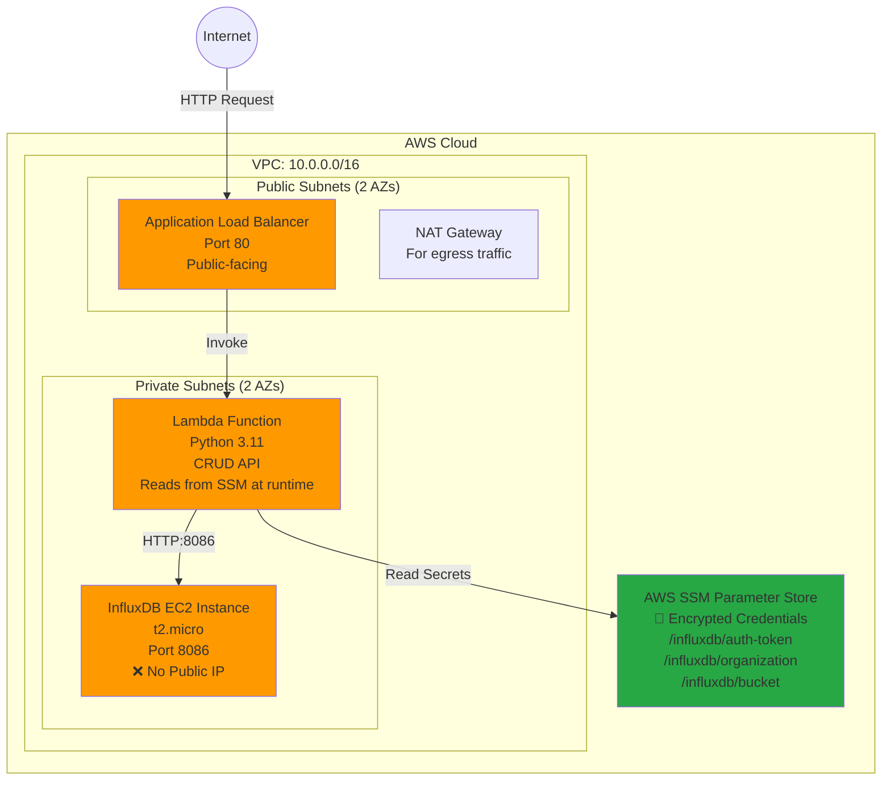

# InfluxDB CRUD Service - AWS CDK Infrastructure

A production-ready, secure AWS infrastructure for deploying a private InfluxDB time-series database with a serverless CRUD API, featuring SSM Parameter Store for credential management.

## 📊 Architecture Overview



## 🔑 Key Features

### Security
- 🔒 **Private InfluxDB** - Zero public exposure, only accessible from Lambda within VPC
- 🔐 **SSM Parameter Store** - Credentials encrypted at rest (SecureString)
- 🛡️ **IAM Least Privilege** - Lambda has only required SSM read permissions
- 🌐 **Network Isolation** - Multi-AZ deployment with proper subnet segmentation

### Infrastructure
- ⚡ **Serverless API** - AWS Lambda with automatic scaling
- 🏗️ **Modular CDK** - 6 reusable constructs for maintainability
- 📊 **CloudWatch Monitoring** - Alarms for Lambda, ALB, and EC2
- 🔄 **High Availability** - Multi-AZ deployment with NAT Gateway

### Development
- 🧪 **Comprehensive Testing** - 70+ unit tests with Jest
- 📦 **Modern Tooling** - TypeScript
- 🚀 **CI/CD Ready** - Automated deployment scripts

## 📋 Prerequisites

### Required Software

```bash
# 1. Install Node.js and npm (if not already installed)
node --version  # Should be v18+ 
npm --version   # Should be v9+

# 2. Install AWS CLI v2
# macOS:
brew install awscli

# Linux:
curl "https://awscli.amazonaws.com/awscli-exe-linux-x86_64.zip" -o "awscliv2.zip"
unzip awscliv2.zip
sudo ./aws/install

# Verify
aws --version  # Should be aws-cli/2.x
```

### AWS Account Setup

1. **AWS Account** - You need an active AWS account
2. **AWS Credentials** - Configure your credentials:

```bash
aws configure
# AWS Access Key ID: [Your access key]
# AWS Secret Access Key: [Your secret key]
# Default region name: eu-central-1  (or your preferred region)
# Default output format: json
```

3. **Required IAM Permissions:**
   - CloudFormation (create/update stacks)
   - EC2 (VPC, instances, security groups)
   - Lambda (create functions)
   - IAM (create roles and policies)
   - SSM (create/read parameters)
   - Elastic Load Balancing (create ALB)
   - CloudWatch (create alarms and logs)

## 🚀 Deployment Guide (Complete Step-by-Step)

### Step 1: Clone and Setup

```bash
# Clone the repository
git clone <repository-url>
cd test

# Install dependencies
npm install

# Make scripts executable
chmod +x scripts/*.sh
```

### Step 2: Bootstrap CDK (First Time Only)

This creates the necessary CDK resources in your AWS account:

```bash
npx cdk bootstrap
```

**Expected Output:**
```
✅ Environment aws://YOUR-ACCOUNT-ID/eu-central-1 bootstrapped
```

### Step 3: Create SSM Parameters

Store the InfluxDB credentials securely in AWS Systems Manager Parameter Store:

```bash
# Create auth token (SecureString - encrypted at rest)
aws ssm put-parameter \
  --name "/influxdb/auth-token" \
  --value "my-super-secret-auth-token" \
  --type SecureString

# Create organization name
aws ssm put-parameter \
  --name "/influxdb/organization" \
  --value "myorg" \
  --type String

# Create bucket name
aws ssm put-parameter \
  --name "/influxdb/bucket" \
  --value "mybucket" \
  --type String
```

**Note:** These values must match the InfluxDB Docker container configuration in `lib/constructs/influxdb-instance.ts`.

### Step 4: Deploy the Infrastructure

```bash
npm run deploy
```

**Deployment Process:**
1. CDK synthesizes CloudFormation template (~5s)
2. Shows you the changes to be deployed
3. Prompts for confirmation: Type `y` and press Enter
4. Creates all AWS resources (~12-15 minutes)

**Expected Output:**
```
✨  Deployment time: 354.98s

Outputs:
InfluxDbCrudStack.ALBDnsName = Influx-CrudA-xxxxx.eu-central-1.elb.amazonaws.com
InfluxDbCrudStack.ApiEndpoint = http://Influx-CrudA-xxxxx.eu-central-1.elb.amazonaws.com
InfluxDbCrudStack.InfluxDbPrivateIp = 10.0.2.70
InfluxDbCrudStack.VpcId = vpc-xxxxx

✅ Stack deployed successfully!
```

**⚠️ Important:** Save the `ALBDnsName` - you'll need it for testing!

### Step 5: Verify Deployment

```bash
# Check deployment status and API health
./scripts/check-deployment-status.sh
```

**Expected Output:**
```
✓ Stack is deployed successfully
✓ API is healthy and responding
✓ Deployment is complete and healthy! 🚀
```

## 🧪 Testing

### Automated Integration Tests (Recommended)

Run the comprehensive test suite that validates all CRUD operations:

```bash
# Auto-discover ALB DNS and run all tests
./scripts/test-api.sh
```

**Test Coverage:**
- ✅ Health check endpoint
- ✅ Create data (POST /data)
- ✅ Retrieve data (GET /data)
- ✅ Update data (PUT /data/:id)
- ✅ Delete data (DELETE /data/:id)
- ✅ Error handling (404 responses)

**Expected Output:**
```
================================================================
Test Summary
================================================================

  Total Tests:    15
  Passed:         15
  Failed:         0

✓ All tests passed! 🎉
```

### Manual API Testing

```bash
# Get your ALB DNS
ALB_DNS=$(aws cloudformation describe-stacks --stack-name InfluxDbCrudStack --query 'Stacks[0].Outputs[?OutputKey==`ALBDnsName`].OutputValue' --output text)

# Health check
curl http://${ALB_DNS}/health

# Create a data point
curl -X POST http://${ALB_DNS}/data \
  -H "Content-Type: application/json" \
  -d '{
    "measurement": "temperature",
    "tags": {"location": "room1", "sensor_id": "sensor_001"},
    "fields": {"value": 22.5}
  }'

# Get all data
curl http://${ALB_DNS}/data

# Update a data point
curl -X PUT http://${ALB_DNS}/data/sensor_001 \
  -H "Content-Type: application/json" \
  -d '{
    "measurement": "temperature",
    "tags": {"location": "room1", "sensor_id": "sensor_001"},
    "fields": {"value": 23.0}
  }'

# Delete a data point
curl -X DELETE http://${ALB_DNS}/data/sensor_001
```

### Unit Tests

Run the TypeScript/Jest test suite:

```bash
# Run all unit tests
npm test

# Watch mode (auto-rerun on changes)
npm run test:watch

# Generate coverage report
npm run test:coverage
```

**Expected Output:**
```
Test Suites: 7 passed, 7 total
Tests:       70 passed, 70 total
Coverage:    85%+
Time:        ~6s
```

## 📁 Project Structure

```
test/
├── bin/
│   └── app.ts                          # CDK app entry point
├── lib/
│   ├── influxdb-crud-stack.ts          # Main stack definition (with SSM integration)
│   └── constructs/                     # Reusable CDK constructs
│       ├── networking.ts               # VPC, subnets, NAT, IGW
│       ├── security-groups.ts          # Security group rules
│       ├── influxdb-instance.ts        # EC2 instance for InfluxDB
│       ├── lambda-crud-api.ts          # Lambda function with SSM access
│       ├── load-balancer.ts            # ALB configuration
│       └── monitoring.ts               # CloudWatch alarms
├── lambda/
│   └── index.py                        # Python Lambda handler (CRUD operations)
├── scripts/
│   ├── check-deployment-status.sh      # ✅ Verify deployment and API health
│   ├── get-alb-dns.sh                  # ✅ Retrieve ALB DNS name
│   ├── test-api.sh                     # ✅ Run integration tests
│   └── quick-test-guide.sh             # ✅ Display quick reference
├── test/
│   ├── influxdb-crud-stack.test.ts     # Stack-level tests
│   └── constructs/                     # Unit tests for each construct
├── cdk.json                            # CDK configuration
├── package.json                        # npm dependencies
├── tsconfig.json                       # TypeScript configuration
└── README.md                           # This file
```

### Unused Files (Can Be Ignored or Deleted)

These files are present but not currently used in the deployment:

- `age-key.txt` - Age encryption key (for SOPS, not currently used)
- `secrets.yaml` - Encrypted secrets file (not used, credentials in SSM instead)
- `scripts/decrypt-secrets.py` - SOPS decryption script (not needed with manual SSM setup)
- `pyproject.toml` / `uv.lock` - UV package manager files (optional, for Python dependencies)
- `current-kms-policy.json` - KMS policy reference (not currently used)
- `cdk.context.json` - CDK context cache (auto-generated, can be deleted)

**Safe to delete:**
```bash
rm age-key.txt secrets.yaml current-kms-policy.json
rm scripts/decrypt-secrets.py
rm pyproject.toml uv.lock
```

## 🏗️ Architecture Details

### Network Architecture

**VPC Configuration:**
- CIDR: 10.0.0.0/16
- 2 Availability Zones
- 2 Public Subnets (for ALB and NAT Gateway)
- 2 Private Subnets (for Lambda and EC2)
- Internet Gateway for public subnets
- NAT Gateway for private subnet egress

**Security Groups:**
1. **ALB Security Group**
   - Inbound: Port 80 from 0.0.0.0/0 (public internet)
   - Outbound: All traffic

2. **Lambda Security Group**
   - Inbound: None (invoked by ALB)
   - Outbound: All traffic (to reach InfluxDB and SSM)

3. **InfluxDB Security Group**
   - Inbound: Port 8086 from Lambda Security Group only
   - Outbound: All traffic

### Data Flow

1. **User Request** → ALB (public endpoint)
2. **ALB** → Invokes Lambda function
3. **Lambda** → Reads credentials from SSM Parameter Store
4. **Lambda** → Makes HTTP request to InfluxDB (port 8086)
5. **InfluxDB** → Processes request and returns data
6. **Lambda** → Returns response to ALB
7. **ALB** → Returns response to user

### SSM Parameter Store Integration

**Parameters Created:**
- `/influxdb/auth-token` (SecureString) - InfluxDB authentication token
- `/influxdb/organization` (String) - InfluxDB organization name
- `/influxdb/bucket` (String) - InfluxDB bucket name

**Lambda Configuration:**
- Environment variables contain SSM parameter names (not values)
- IAM role grants `ssm:GetParameter` permission
- Credentials fetched at Lambda runtime (not at deployment time)
- Encrypted in transit and at rest

## 🛠️ Utility Scripts

### `check-deployment-status.sh`
Comprehensive deployment verification script.

```bash
./scripts/check-deployment-status.sh
```

**Features:**
- Checks CloudFormation stack status
- Retrieves ALB DNS name
- Tests API health endpoint
- Detects active deployment processes

**Exit Codes:**
- `0` - Deployment complete and healthy
- `1` - Deployment failed or unhealthy
- `2` - Deployment in progress

### `get-alb-dns.sh`
Retrieves the ALB DNS name from CloudFormation.

```bash
./scripts/get-alb-dns.sh
```

**Output:**
```
✓ Found via CloudFormation:
  Influx-CrudA-xxxxx.eu-central-1.elb.amazonaws.com
```

### `test-api.sh`
Comprehensive integration test suite for the API.

```bash
# Auto-discover ALB DNS
./scripts/test-api.sh

# Use specific ALB DNS
./scripts/test-api.sh my-alb-xxxxx.region.elb.amazonaws.com
```

**Test Suites:**
1. Health Check
2. Create Data (POST)
3. Retrieve Data (GET)
4. Update Data (PUT)
5. Delete Data (DELETE)
6. Error Handling

### `quick-test-guide.sh`
Displays quick reference for testing commands.

```bash
./scripts/quick-test-guide.sh
```

## 🔧 Common Issues & Troubleshooting

### Issue: Deployment fails with "AlreadyExists" error

**Problem:** SSM parameter already exists from previous deployment.

**Solution:**
```bash
# Update existing parameters with --overwrite flag
aws ssm put-parameter --name "/influxdb/auth-token" \
  --value "my-super-secret-auth-token" \
  --type SecureString --overwrite
```

### Issue: API returns 502 Bad Gateway

**Problem:** InfluxDB instance not fully initialized yet.

**Solution:**
- Wait 5-10 minutes after deployment for InfluxDB Docker container to start
- Check EC2 instance logs:
```bash
# Get instance ID
aws ec2 describe-instances --filters "Name=tag:Name,Values=InfluxDbInstance" \
  --query "Reservations[].Instances[].InstanceId" --output text

# View user-data logs via SSM Session Manager
aws ssm start-session --target <instance-id>
# Then run: cat /var/log/user-data.log
```

### Issue: Root path (/) returns "Not found"

**Status:** ✅ This is expected behavior

**Explanation:** The root path is not defined. Use specific endpoints:
- `/health` - Health check
- `/data` - CRUD operations

### Issue: Cannot assume CDK roles (warnings during deployment)

**Status:** ⚠️ Warning only, deployment proceeds

**Explanation:** Using direct credentials instead of assuming CDK-created roles. This is normal and doesn't prevent deployment.

### Issue: Tests fail with "Connection refused"

**Problem:** InfluxDB not running or network configuration issue.

**Solution:**
1. Check EC2 instance status in AWS Console
2. Verify security group rules
3. Wait longer for InfluxDB initialization
4. Check Lambda logs in CloudWatch

## 🧹 Cleanup

### Delete All Resources

```bash
# Delete the CloudFormation stack (removes all resources)
npm run destroy
```

**⚠️ Warning:** This will delete:
- VPC and all subnets
- EC2 instance (InfluxDB data will be lost)
- Lambda function
- Application Load Balancer
- Security groups
- CloudWatch alarms and logs

**SSM Parameters are NOT automatically deleted.** To remove them:

```bash
# Delete SSM parameters
aws ssm delete-parameter --name "/influxdb/auth-token"
aws ssm delete-parameter --name "/influxdb/organization"
aws ssm delete-parameter --name "/influxdb/bucket"
```

## 📊 Cost Estimation

**Monthly AWS Costs** (eu-central-1 region, approximate):

| Service | Configuration | Monthly Cost |
|---------|---------------|--------------|
| EC2 (t2.micro) | 1 instance, 24/7 | ~$8.50 |
| NAT Gateway | 1 gateway, minimal data | ~$32.00 |
| Application Load Balancer | Basic usage | ~$16.20 |
| Lambda | 1M requests, 512MB, 1s avg | ~$0.20 |
| CloudWatch | Logs and alarms | ~$2.00 |
| SSM Parameter Store | Standard parameters | $0.00 |
| **Total** | | **~$58.90/month** |

**Notes:**
- Costs vary by region
- NAT Gateway is the most expensive component
- Free tier eligible (first 12 months): EC2 t2.micro, Lambda, ALB (partial)
- Data transfer costs not included

## 📝 API Reference

### Endpoints

#### `GET /health`
Health check endpoint.

**Response:**
```json
{
  "status": "healthy",
  "timestamp": "2025-10-04T16:17:47.313710"
}
```

#### `POST /data`
Create a new data point in InfluxDB.

**Request Body:**
```json
{
  "measurement": "temperature",
  "tags": {
    "location": "room1",
    "sensor_id": "sensor_001"
  },
  "fields": {
    "value": 22.5
  }
}
```

**Response:**
```json
{
  "message": "Data created successfully"
}
```

#### `GET /data`
Retrieve all data points from the last 7 days.

**Response:**
```json
{
  "data": [
    {
      "_time": "2025-10-04T16:17:56.851754441Z",
      "_value": "22.5",
      "_field": "value",
      "_measurement": "temperature",
      "location": "room1",
      "sensor_id": "sensor_001"
    }
  ]
}
```

#### `PUT /data/:id`
Update a data point (creates a new point and deletes old).

**URL Parameters:**
- `id` - Sensor ID or tag value to match

**Request Body:**
```json
{
  "measurement": "temperature",
  "tags": {
    "location": "room1",
    "sensor_id": "sensor_001"
  },
  "fields": {
    "value": 23.0
  }
}
```

**Response:**
```json
{
  "message": "Data sensor_001 updated successfully"
}
```

#### `DELETE /data/:id`
Delete data points matching the sensor ID.

**URL Parameters:**
- `id` - Sensor ID or tag value to match

**Response:**
```json
{
  "message": "Data sensor_001 deleted successfully"
}
```

## 📚 Additional Resources

- [AWS CDK Documentation](https://docs.aws.amazon.com/cdk/)
- [InfluxDB Documentation](https://docs.influxdata.com/)
- [AWS Lambda Python](https://docs.aws.amazon.com/lambda/latest/dg/lambda-python.html)
- [AWS Systems Manager Parameter Store](https://docs.aws.amazon.com/systems-manager/latest/userguide/systems-manager-parameter-store.html)

## 📄 License

ISC

---

**Built with ❤️ using AWS CDK, TypeScript, and Python**
