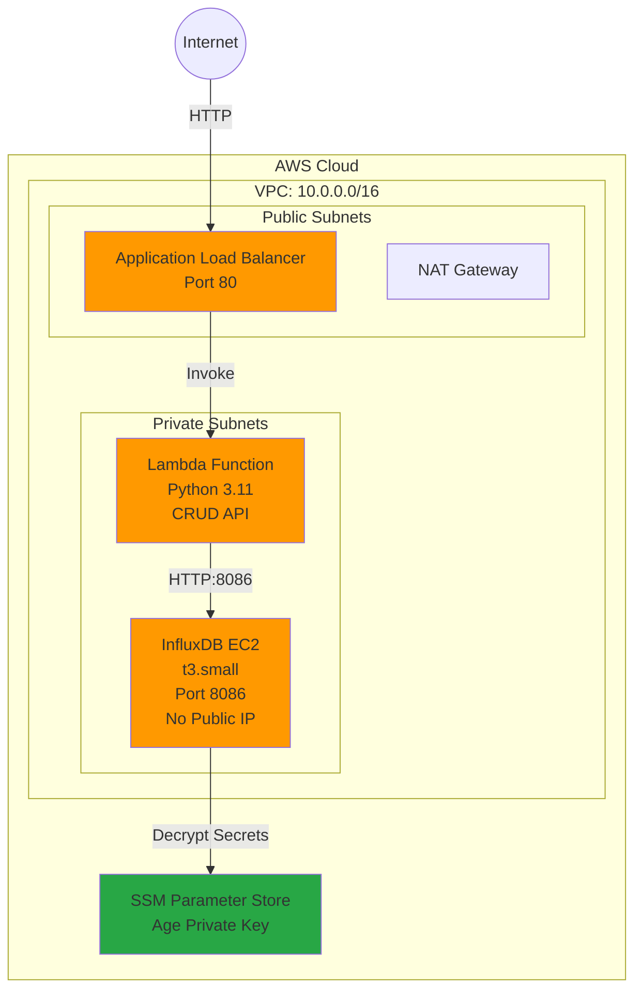

# InfluxDB CRUD Service - AWS CDK

A production-ready, modular AWS infrastructure for deploying a private InfluxDB instance with a serverless CRUD API.

## 📊 Architecture



**Key Features:**
- 🔒 **Private InfluxDB** - No public IP, accessible only from Lambda
- ⚡ **Serverless API** - Lambda with automatic scaling
- 🔐 **Secrets Management** - SOPS/Age encryption (no hardcoded credentials)
- 📦 **Modern Tooling** - UV package manager, Jest testing
- 🏗️ **Modular Design** - 6 reusable CDK constructs

## 🚀 Quick Start

### Prerequisites

```bash
# Install UV package manager
curl -LsSf https://astral.sh/uv/install.sh | sh

# Install SOPS and Age
brew install sops age  # macOS
# OR
# Linux: Download from GitHub releases

# Verify installations
uv --version
sops --version
age --version

# Install project dependencies
npm install
uv sync
```

### Deploy

```bash
# 1. Bootstrap CDK (first time only)
cdk bootstrap

# 2. Store age private key in AWS SSM
aws ssm put-parameter \
  --name "/influxdb/age-private-key" \
  --value "$(cat age-key.txt)" \
  --type SecureString

# 3. Deploy the stack
npm run deploy

# Note your ALB DNS from the output:
# Outputs:
# InfluxDbCrudStack.ALBDnsName = your-alb-xxxxx.region.elb.amazonaws.com
```

**Deployment time:** ~12-15 minutes

### Cleanup

```bash
npm run destroy
```

## 🧪 Testing

### Unit Tests

Run the full test suite (70 tests across 7 test files):

```bash
# Run all tests
npm test

# Watch mode (auto-rerun on changes)
npm run test:watch

# Generate coverage report
npm run test:coverage
```

**Expected output:**
```
Test Suites: 7 passed, 7 total
Tests:       70 passed, 70 total
Time:        ~6s
Coverage:    80%+
```

### Finding Your ALB DNS

After deployment, you need the Application Load Balancer DNS name to test the API:

```bash
# Make scripts executable (first time only)
chmod +x scripts/*.sh

# Option 1: Check deployment status (requires CloudFormation permissions)
./scripts/check-deployment-status.sh

# Option 2: Use the helper script to find ALB DNS
./scripts/get-alb-dns.sh

# Option 3: Manual lookup - Check deployment output for:
# "InfluxDbCrudStack.ALBDnsName = your-alb-xxxxx.region.elb.amazonaws.com"
```

**Note**: If you don't have CloudFormation permissions, the ALB DNS will be shown in your deployment terminal output.

**Sample Output:**
```
╔══════════════════════════════════════════════════════════════╗
║        CDK Deployment Status Checker                         ║
╚══════════════════════════════════════════════════════════════╝

ℹ Checking CloudFormation stack: InfluxDbCrudStack

  Status: CREATE_COMPLETE
✓ Stack is deployed successfully

ℹ Retrieving stack outputs...

  ALB DNS: my-alb-123456.eu-central-1.elb.amazonaws.com

ℹ Checking API health...

  Attempt 1/3: OK
✓ API is healthy and responding

✓ Deployment is complete and healthy! 🚀

  You can now test the API:
    ./scripts/test-api.sh
```

**Exit codes:**
- `0` - Stack deployed and healthy (ready to test)
- `1` - Stack not deployed or unhealthy
- `2` - Stack deployment in progress

### API Endpoint Testing

#### Option 1: Automated Integration Tests (Recommended)

Run the comprehensive test suite that validates all CRUD operations:

```bash
# Make script executable (first time only)
chmod +x scripts/test-api.sh

# Auto-discover ALB DNS from CloudFormation (recommended)
./scripts/test-api.sh

# Or specify ALB DNS manually
./scripts/test-api.sh my-alb-123456.eu-central-1.elb.amazonaws.com
```

**Features:**
- ✅ Auto-discovers ALB DNS from CloudFormation
- ✅ Validates HTTP status codes and response structure
- ✅ Tests all CRUD operations (Create, Read, Update, Delete)
- ✅ Includes error handling tests
- ✅ Automatic cleanup of test data
- ✅ Color-coded output with pass/fail indicators
- ✅ Comprehensive test summary

**Sample Output:**
```
╔══════════════════════════════════════════════════════════════╗
║     InfluxDB CRUD API Integration Test Suite                ║
╚══════════════════════════════════════════════════════════════╝

✓ All prerequisites installed
ℹ Retrieving ALB DNS from CloudFormation stack
ℹ Test Configuration:
  Base URL: http://my-alb-123456.eu-central-1.elb.amazonaws.com
  Test ID: test_1696348800

ℹ Waiting for API to be healthy...
✓ API is healthy

================================================================
Test Suite 1: Health Check
================================================================
Response: {"status":"healthy","timestamp":"2025-10-03T12:34:56.123456"}
✓ Test 1: Health check returns 200 OK (Status: 200)
✓ Test 2: Health status is 'healthy'
✓ Test 3: Timestamp field exists

================================================================
Test Suite 2: Create Data (POST /data)
================================================================
Response: {"message":"Data created successfully"}
✓ Test 4: Create data point 1 returns 201 Created (Status: 201)
✓ Test 5: Success message received
Response: {"message":"Data created successfully"}
✓ Test 6: Create data point 2 returns 201 Created (Status: 201)

================================================================
Test Suite 3: Retrieve Data (GET /data)
================================================================
✓ Test 7: Get all data returns 200 OK (Status: 200)
✓ Test 8: Response contains 'data' field
✓ Test 9: Created data point 1 exists in response

================================================================
Test Suite 4: Update Data (PUT /data/:id)
================================================================
Response: {"message":"Data test_1696348800_sensor_001 updated successfully"}
✓ Test 10: Update data returns 200 OK (Status: 200)
✓ Test 11: Update success message received

================================================================
Test Suite 5: Delete Data (DELETE /data/:id)
================================================================
Response: {"message":"Data test_1696348800_sensor_001 deleted successfully"}
✓ Test 12: Delete data returns 200 OK (Status: 200)
✓ Test 13: Delete success message received
✓ Test 14: Deleted data no longer appears in results

================================================================
Test Suite 6: Error Handling
================================================================
✓ Test 15: Invalid endpoint returns 404 Not Found (Status: 404)

================================================================
Test Summary
================================================================

  Total Tests:    15
  Passed:         15
  Failed:         0

✓ All tests passed! 🎉
```

**Exit codes:**
- `0` - All tests passed
- `1` - One or more tests failed
- `2` - Prerequisites missing or setup failed

#### Option 2: Manual Testing with cURL

For manual testing or debugging, use cURL commands directly:

**1. Health Check**
```bash
curl http://<ALB-DNS>/health | jq '.'
```
**Expected Response:**
```json
{
  "status": "healthy",
  "timestamp": "2025-10-03T10:30:00.000000"
}
```

**2. Create Data**
```bash
curl -X POST http://<ALB-DNS>/data \
  -H "Content-Type: application/json" \
  -d '{
    "measurement": "sensor_data",
    "tags": {"sensor_id": "sensor_001", "location": "office"},
    "fields": {"temperature": 22.5, "humidity": 65}
  }' | jq '.'
```
**Expected Response:**
```json
{
  "message": "Data created successfully"
}
```

**3. Get All Data**
```bash
curl http://<ALB-DNS>/data | jq '.'
```
**Expected Response:**
```json
{
  "data": [
    {
      "_time": "2025-10-03T10:30:00Z",
      "_measurement": "sensor_data",
      "sensor_id": "sensor_001",
      "temperature": "22.5",
      "humidity": "65"
    }
  ]
}
```

**4. Update Data**
```bash
curl -X PUT http://<ALB-DNS>/data/sensor_001 \
  -H "Content-Type: application/json" \
  -d '{
    "measurement": "sensor_data",
    "tags": {"sensor_id": "sensor_001"},
    "fields": {"temperature": 25.0, "humidity": 70}
  }' | jq '.'
```
**Expected Response:**
```json
{
  "message": "Data sensor_001 updated successfully"
}
```

**5. Delete Data**
```bash
curl -X DELETE http://<ALB-DNS>/data/sensor_001 | jq '.'
```
**Expected Response:**
```json
{
  "message": "Data sensor_001 deleted successfully"
}
```

### Troubleshooting Tests

#### Quick Troubleshooting Guide
```bash
# See all available commands and common issues
./scripts/quick-test-guide.sh
```

#### Test script fails with "Could not retrieve ALB DNS"
**Cause**: Missing AWS CloudFormation permissions

**Solutions**:
```bash
# Option 1: Use the helper script
./scripts/get-alb-dns.sh

# Option 2: Find ALB DNS in AWS Console
# Go to: EC2 > Load Balancers > Look for "Influx-CrudA-*"

# Option 3: Check your deployment terminal output for:
# "InfluxDbCrudStack.ALBDnsName = your-alb-xxxxx.elb.amazonaws.com"

# Then run tests with explicit DNS:
./scripts/test-api.sh "your-alb-xxxxx.region.elb.amazonaws.com"
```

#### Health check passes but CRUD operations fail with "Connection refused"
**Cause**: Lambda cannot connect to InfluxDB on port 8086

**Diagnosis**: Error message shows `HTTPConnectionPool(host='10.0.x.x', port=8086): ... Connection refused`

**Solutions**:
1. **Wait for InfluxDB initialization** (5-10 minutes after first deployment)
2. **Check InfluxDB is running**:
   ```bash
   # Find EC2 instance ID
   aws ec2 describe-instances \
     --filters "Name=tag:Name,Values=*InfluxDbInstance*" \
     --query "Reservations[0].Instances[0].InstanceId"
   
   # Connect via SSM and check status
   aws ssm start-session --target <INSTANCE_ID>
   sudo systemctl status influxdb
   ```
3. **Verify security groups** allow Lambda → InfluxDB on port 8086
4. **Check Lambda logs**:
   ```bash
   aws logs tail /aws/lambda/InfluxDbCrudStack-CrudLambdaFunction --follow
   ```

#### Tests pass but data doesn't appear in GET requests
**Cause**: InfluxDB eventual consistency

This is normal behavior! InfluxDB may have a slight delay before data becomes queryable. The test script accounts for this with sleep intervals between operations.

#### "jq: command not found"
```bash
# Install jq for better JSON handling
brew install jq  # macOS
# or
sudo apt-get install jq  # Ubuntu/Debian
```

#### All tests fail immediately
**Checklist**:
- ✅ Stack is deployed (`cdk deploy` completed successfully)
- ✅ ALB DNS is correct (no typos, no newlines)
- ✅ ALB is in "active" state (check EC2 console)
- ✅ Target group has healthy targets
- ✅ Lambda function exists and has correct VPC configuration

## 📋 Useful Commands

### Development

```bash
# Build TypeScript
npm run build

# Generate CloudFormation template
npm run synth

# Show deployment diff
npm run diff

# Compile in watch mode
npm run watch
```

### Python Dependencies (UV)

```bash
# Add a new dependency
uv add <package-name>

# Update dependencies
uv lock --upgrade

# Sync dependencies after git pull
uv sync
```

### Secrets Management (SOPS)

```bash
# View encrypted secrets
export SOPS_AGE_KEY_FILE=age-key.txt
sops secrets.yaml

# Edit secrets (auto-encrypts on save)
sops secrets.yaml

# Decrypt to view
sops -d secrets.yaml
```

### AWS/Monitoring

```bash
# View Lambda logs
aws logs tail /aws/lambda/InfluxDbCrudStack-CrudLambdaFunction --follow

# Check CloudWatch alarms
aws cloudwatch describe-alarms

# Connect to InfluxDB instance (via SSM)
INSTANCE_ID=$(aws ec2 describe-instances \
  --filters "Name=tag:Name,Values=*InfluxDbInstance*" \
  --query "Reservations[0].Instances[0].InstanceId" \
  --output text)
aws ssm start-session --target $INSTANCE_ID
```

## 📁 Project Structure

```
├── lib/
│   ├── constructs/              # Modular CDK constructs
│   │   ├── networking.ts        # VPC, subnets, NAT (85 lines)
│   │   ├── security-groups.ts   # Security groups (81 lines)
│   │   ├── influxdb-instance.ts # InfluxDB EC2 (245 lines)
│   │   ├── lambda-crud-api.ts   # Lambda function (97 lines)
│   │   ├── load-balancer.ts     # ALB setup (108 lines)
│   │   └── monitoring.ts        # CloudWatch alarms (128 lines)
│   └── influxdb-crud-stack.ts   # Main stack (108 lines)
├── lambda/
│   └── index.py                 # Lambda CRUD function
├── test/
│   ├── constructs/              # Unit tests per construct
│   └── influxdb-crud-stack.test.ts
├── scripts/
│   ├── test-api.sh              # API testing script
│   └── check-deployment-status.sh
├── pyproject.toml               # Python dependencies (UV)
├── package.json                 # Node.js dependencies
└── secrets.yaml                 # Encrypted secrets (SOPS)
```

## 🔧 Technical Specifications

| Component | Details |
|-----------|---------|
| **Region** | eu-central-1 (configurable) |
| **VPC** | 10.0.0.0/16, 2 AZs, 4 subnets |
| **InfluxDB** | EC2 t3.small, 20GB GP3, Amazon Linux 2023 |
| **Lambda** | Python 3.11, 30s timeout, VPC-enabled |
| **ALB** | Internet-facing, HTTP port 80 |
| **Secrets** | SOPS + Age encryption |
| **Package Manager** | UV (10-100x faster than pip) |
| **Testing** | Jest + CDK Assertions, 70 tests |

## 💰 Cost Estimate

| Resource | Monthly Cost |
|----------|--------------|
| EC2 t3.small | ~$15 |
| NAT Gateway | ~$33 |
| ALB | ~$17 |
| Lambda | Free tier |
| **Total** | **~$70-100/month** |

💡 **Tip:** Run `npm run destroy` when not in use to avoid charges.

## 🐛 Troubleshooting

### Lambda can't connect to InfluxDB
- Wait 5-10 minutes after deployment for InfluxDB to initialize
- Check security groups allow port 8086 traffic
- Verify Lambda is in correct VPC

### Health check returns 503
```bash
# Check Lambda logs
aws logs tail /aws/lambda/InfluxDbCrudStack-CrudLambdaFunction --follow

# Verify InfluxDB is running
aws ssm start-session --target <INSTANCE-ID>
sudo systemctl status influxdb
```

### SOPS decryption fails
```bash
# Verify age key is set
export SOPS_AGE_KEY_FILE=age-key.txt

# Test decryption
sops -d secrets.yaml

# Check SSM parameter exists
aws ssm get-parameter --name "/influxdb/age-private-key" --with-decryption
```

### Tests failing
```bash
# Clear Jest cache and rebuild
npm test -- --clearCache
npm run build && npm test
```

## 📚 API Reference

| Method | Endpoint | Description |
|--------|----------|-------------|
| GET | `/health` | Health check |
| POST | `/data` | Create time-series data |
| GET | `/data` | Retrieve all data |
| PUT | `/data/:id` | Update specific data point |
| DELETE | `/data/:id` | Delete specific data point |

**Request Body Format (POST/PUT):**
```json
{
  "measurement": "sensor_data",
  "tags": {
    "sensor_id": "sensor_001",
    "location": "office"
  },
  "fields": {
    "temperature": 22.5,
    "humidity": 65
  }
}
```

## 🏆 Key Features

- ✅ **Modular Architecture** - 6 independent, reusable constructs
- ✅ **Secure by Default** - Private networking, encrypted secrets
- ✅ **Production Ready** - 70 tests, 80%+ coverage
- ✅ **Modern Tooling** - UV package manager, SOPS encryption
- ✅ **Well Documented** - Comprehensive README and inline docs
- ✅ **Cost Optimized** - Serverless Lambda, single NAT Gateway
- ✅ **Observable** - CloudWatch logs and alarms

## 🤝 Contributing

This is a demonstration project showcasing AWS CDK best practices. Feel free to use it as a template for your own infrastructure.

## 📄 License

MIT

---

**Status:** Production-Ready | **Tests:** 70/70 Passing | **Coverage:** 80%+
